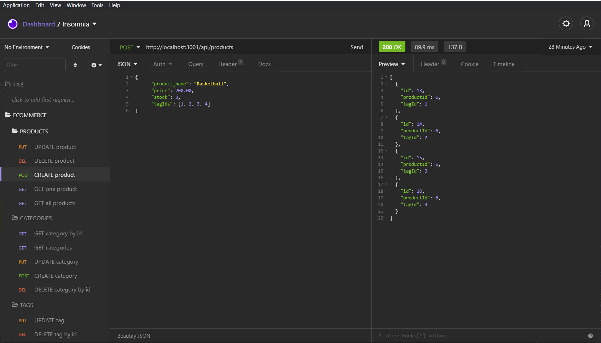

# E_Commerce

## Description
An e-commerce site utilizing Express.js API and Sequelize to interact with a MySQL database.

This built in command-line application allows a manager at an internet retail company to use a functional Express.js API requiring a database name, MySQL username, and MySQL password to be entered into environment variables, to connet to a database using Sequelize. By entering schema, and seeds commands, a development database is created, and is seeded with test data. The command npm run start runs a package.json script to invoke the application, starting the server and syncing the Sequelize models to the MySQL database. 

API routes are then tested in Insomnia Core for categroies, tags, and products, returning data in JSON format. API GET POST PUT and DELETE routes allow the user to successfully CREATE, READ, UPDATE, and DELETE data in the database. Click the link below for a video walkthrough.

**[Check out the video here!](https://drive.google.com/file/d/1q1bYzoWYdOZ0YetXsI5ky9tCB3cfT3Os/view)**

## Table of Contents
* [Usage](#usage)
* [Credits](#credits)
* [License](#license)

## Usage
* **The Finished Product**  

## Credits
Here are a few resources that helped me get this project knocked out!
* [dotenv](https://www.npmjs.com/package/dotenv)
* [MySQL2](https://www.npmjs.com/package/mysql2)
* [Sequelize](https://www.npmjs.com/package/sequelize)

## License
* Link for more information: (https://opensource.org/licenses/MIT)
* MIT License

      Copyright (c) [year] [fullname]
      
      Permission is hereby granted, free of charge, to any person obtaining a copy
      of this software and associated documentation files (the "Software"), to deal
      in the Software without restriction, including without limitation the rights
      to use, copy, modify, merge, publish, distribute, sublicense, and/or sell
      copies of the Software, and to permit persons to whom the Software is
      furnished to do so, subject to the following conditions:
      
      The above copyright notice and this permission notice shall be included in all
      copies or substantial portions of the Software.
      
      THE SOFTWARE IS PROVIDED "AS IS", WITHOUT WARRANTY OF ANY KIND, EXPRESS OR
      IMPLIED, INCLUDING BUT NOT LIMITED TO THE WARRANTIES OF MERCHANTABILITY,
      FITNESS FOR A PARTICULAR PURPOSE AND NONINFRINGEMENT. IN NO EVENT SHALL THE
      AUTHORS OR COPYRIGHT HOLDERS BE LIABLE FOR ANY CLAIM, DAMAGES OR OTHER
      LIABILITY, WHETHER IN AN ACTION OF CONTRACT, TORT OR OTHERWISE, ARISING FROM,
      OUT OF OR IN CONNECTION WITH THE SOFTWARE OR THE USE OR OTHER DEALINGS IN THE
      SOFTWARE.
